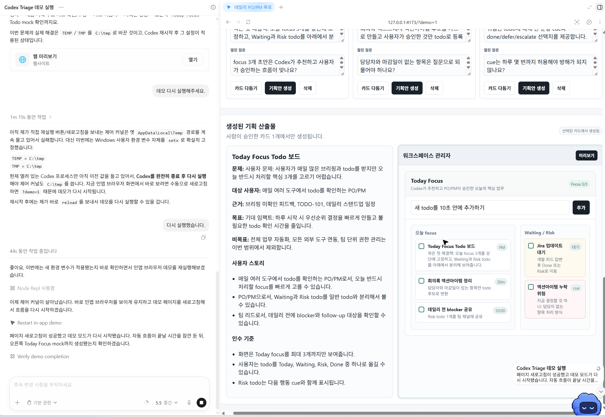
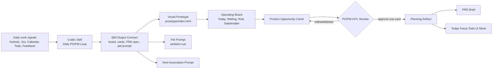
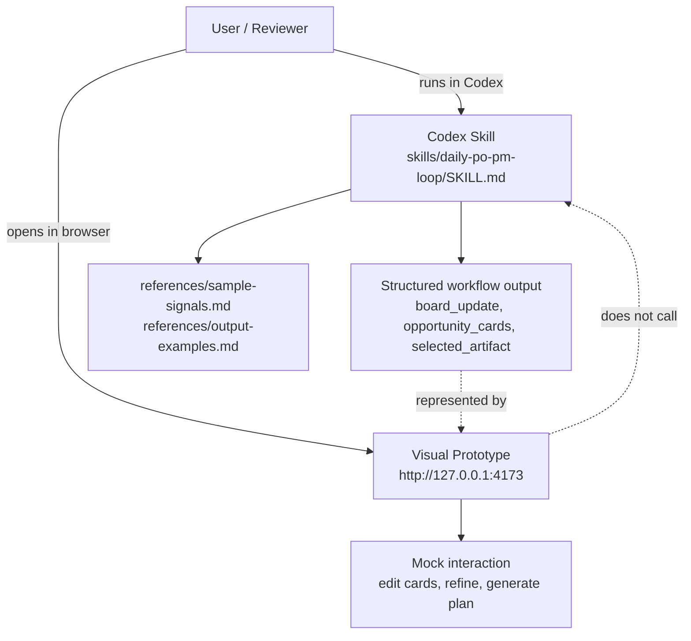
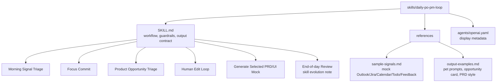

# Daily PO/PM Loop Skillthon Prototype

English | [한국어](README.md)

This repository is a Codex Skillthon submission for a PO/PM daily operating loop.

The core artifact is the Codex Skill in `skills/daily-po-pm-loop/SKILL.md`. The browser prototype in `prototype/` is a visual demo surface that shows what the skill-guided workflow can look like. The prototype does not call Codex by itself.



The screenshot shows the local demo page running inside the Codex App after a selected product opportunity card has been expanded into a PRD and Today Focus Todo mock. Pet notifications are not rendered as a fake overlay inside the browser page; they are intended to appear through the real Codex App active-thread `Pet cue: ...` progress surface.

## Concept

The concept is a human-in-the-loop PO/PM workflow. Codex does not immediately generate an app. The skill first turns daily work signals into an operating board and editable opportunity cards. The PO/PM edits and approves one card, then Codex expands only that card into a PRD and Today Focus Todo mock.



## Skill vs Prototype

The skill and the browser demo have different jobs:



To run the actual skill behavior in Codex, use:

```text
Use the daily-po-pm-loop skill at skills/daily-po-pm-loop.
Read references/sample-signals.md.
Run Morning Signal Triage, propose opportunity cards, wait for my edits, then generate a PRD and UI mock spec only for the selected card.
```

## Skill Structure

The Codex Skill is intentionally small in `SKILL.md` and keeps examples in `references/` so another Codex thread can load only what it needs.



## What is included

- `skills/daily-po-pm-loop/`: Codex Skill package and the primary submission artifact
- `prototype/`: static local demo app that visualizes the skill workflow
- `docs/`: summarized event-guide notes and submission strategy
- `SUBMISSION.md`: Skillathon submission summary
- `server.js`: local preview server for Codex App / browser demos
- `tests/skill_contract.test.js`: contract tests that check the skill and prototype stay aligned
- `docs/06-codex-pet-integration.md`: real Codex Pet demo procedure and boundaries
- `docs/07-codex-runtime-test-prompt.md`: prompt for testing the actual skill behavior in Codex App

## Run the demo

Option 1: open this file in a browser:

```text
prototype/index.html
```

Option 2: run the local preview server:

```powershell
node server.js
```

Then open:

```text
http://127.0.0.1:4173/
http://127.0.0.1:4173/demo.html
```

Prototype demo flow:

1. Click `Codex Triage 실행`.
2. Review the operating board.
3. Edit or add a product opportunity card.
4. Click `카드 다듬기`.
5. Click `기획안 생성`.
6. Show the generated PRD and UI mock preview.

## Test

Run:

```powershell
node tests/skill_contract.test.js
```

The test does not call a model. It verifies that the submitted `SKILL.md`, references, and prototype all contain the contract needed for the demo: HITL opportunity cards, selected-card-only generation, PRD/UI mock output, Pet prompt, automation prompt, and mock signal coverage.

## Codex Pet Integration

To show the real Codex Pet overlay, run the demo in the **Codex App**. Codex Pet is a floating overlay in the Codex App that shows the active thread state and a short progress prompt. The browser prototype does not show its own top-right Pet notification; it only keeps the current cue as inspectable state for automation.

The CLI can test the same skill flow and `Pet cue: ...` output, but it cannot show the Pet overlay. This skill is designed to print `Pet cue: ...` at the top of each phase response. When `/pet` is enabled in the Codex App, the Pet overlay can surface the active thread progress.

See `docs/06-codex-pet-integration.md` for the demo procedure.

To test the actual skill behavior in Codex App, use the prompt in `docs/07-codex-runtime-test-prompt.md`.

## Skillthon Positioning

This is not a todo app, and the browser page is not the skill runtime. It is a Codex-native PO/PM workflow skill plus a visual prototype. The skill defines the reusable procedure; the prototype makes the human-in-the-loop flow easy to understand during the Skillthon demo.

## Submission Links

For reviewers:

- Start here: `SUBMISSION.md`
- Skill: `skills/daily-po-pm-loop/SKILL.md`
- Demo: `http://127.0.0.1:4173/demo.html` after running `node server.js`
