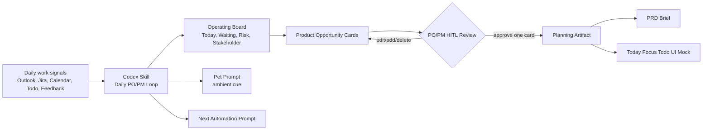
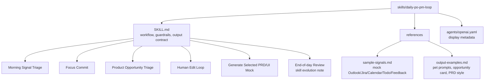

# Daily PO/PM Loop Skillthon Prototype

This workspace contains a Codex Skillthon prototype for a PO/PM daily operating loop.

## Concept

The demo shows a human-in-the-loop PO/PM workflow. Codex does not immediately generate an app. It first turns daily work signals into an operating board and editable opportunity cards. The PO/PM edits and approves one card, then Codex expands only that card into a PRD and Today Focus Todo mock.



## Skill Structure

The Codex Skill is intentionally small in `SKILL.md` and keeps examples in `references/` so another Codex thread can load only what it needs.



## What is included

- `skills/daily-po-pm-loop/`: Codex Skill package
- `prototype/`: static local demo app
- `docs/`: summarized event-guide notes and submission strategy
- `SUBMISSION.md`: Skillathon submission summary

## Run the demo

Option 1: open this file in a browser:

```text
prototype/index.html
```

Option 2: run the local preview server:

```powershell
node server.js
```

Then open:

```text
http://127.0.0.1:4173/
http://127.0.0.1:4173/demo.html
```

Demo flow:

1. Click `Run Codex Triage`.
2. Review the operating board.
3. Edit or add a product opportunity card.
4. Click `Refine Card`.
5. Click `Generate Plan`.
6. Show the generated PRD and UI mock preview.

## Skillthon positioning

This is not a todo app. It is a Codex-native PO/PM workflow skill that turns daily signals into human-approved product opportunities and generates a planning mock only after the PO/PM selects a card.

## Submission links

For reviewers:

- Start here: `SUBMISSION.md`
- Skill: `skills/daily-po-pm-loop/SKILL.md`
- Demo: `http://127.0.0.1:4173/demo.html` after running `node server.js`
