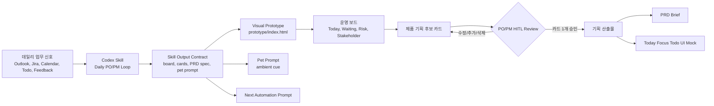
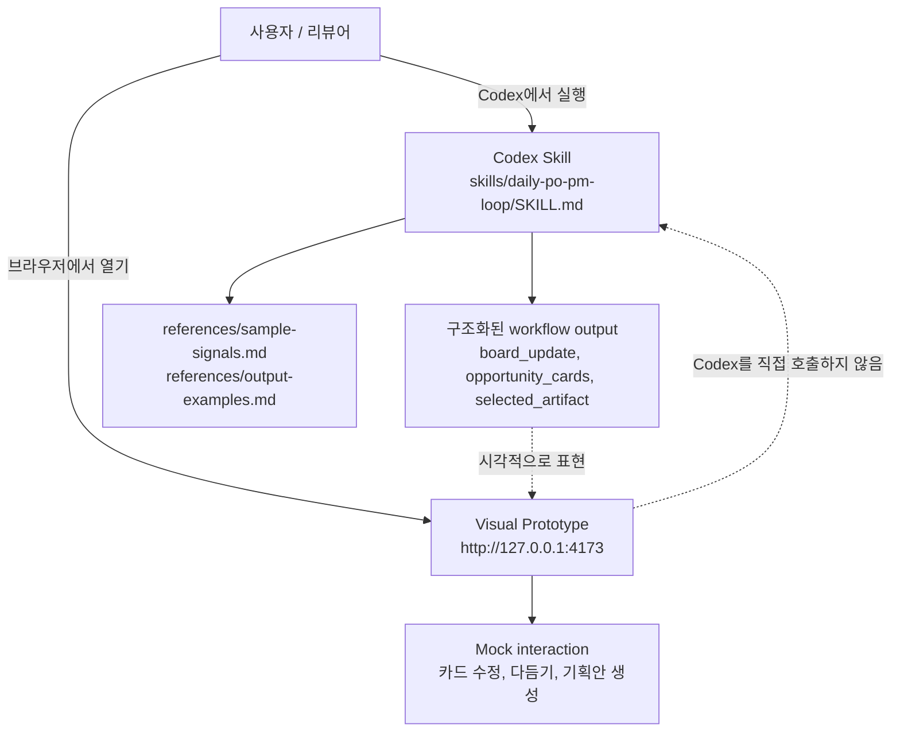
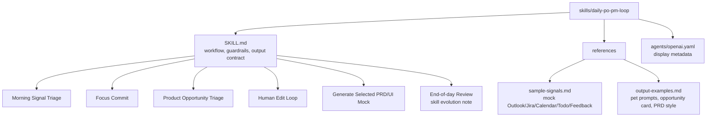

# 데일리 PO/PM 루프 Skillthon Prototype

[English](README.en.md) | 한국어

이 저장소는 PO/PM의 데일리 운영 루프를 위한 Codex Skillthon 제출물입니다.

핵심 산출물은 `skills/daily-po-pm-loop/SKILL.md`에 있는 Codex Skill입니다. `prototype/`의 브라우저 화면은 Skill이 안내하는 업무 흐름이 어떻게 보일 수 있는지 보여주는 시각적 데모입니다. 즉, 브라우저 prototype이 Codex를 직접 호출하는 구조는 아닙니다.


위 화면은 Codex 앱에서 로컬 데모 페이지를 열고, 선택된 제품 기획 후보 카드가 PRD와 Today Focus Todo mock으로 확장된 상태입니다. Pet 알림은 브라우저 페이지 안에서 가짜 overlay로 띄우지 않고, 실제 Codex 앱의 active thread `Pet cue: ...` 진행 상태로 보여주는 구조입니다.

## 컨셉

이 데모는 human-in-the-loop PO/PM workflow를 보여줍니다. Codex가 바로 앱을 생성하지 않습니다. Skill은 먼저 데일리 업무 신호를 운영 보드와 수정 가능한 제품 기획 후보 카드로 정리합니다. PO/PM이 카드 하나를 수정하고 승인하면, Codex는 선택된 카드 1개만 PRD와 Today Focus Todo mock으로 확장합니다.



## Skill과 Prototype의 관계

Skill과 브라우저 데모의 역할은 다릅니다.



실제 Skill 동작을 Codex에서 실행하려면 아래 프롬프트를 사용합니다.

```text
Use the daily-po-pm-loop skill at skills/daily-po-pm-loop.
Read references/sample-signals.md.
Run Morning Signal Triage, propose opportunity cards, wait for my edits, then generate a PRD and UI mock spec only for the selected card.
```

## Skill 구성

Codex Skill은 `SKILL.md`를 짧게 유지하고, 예시와 긴 자료는 `references/`에 분리했습니다. 이렇게 하면 다른 Codex thread가 필요한 맥락만 로드할 수 있습니다.



## 포함된 파일

- `skills/daily-po-pm-loop/`: Codex Skill package이자 핵심 제출물
- `prototype/`: Skill workflow를 시각화하는 정적 로컬 데모 앱
- `docs/`: 행사 가이드 요약과 제출 전략 문서
- `SUBMISSION.md`: Skillthon 제출 요약
- `server.js`: Codex App / 브라우저 데모용 로컬 preview server
- `tests/skill_contract.test.js`: Skill과 prototype의 계약이 맞는지 확인하는 테스트
- `docs/06-codex-pet-integration.md`: 실제 Codex Pet 데모 방법과 한계
- `docs/07-codex-runtime-test-prompt.md`: Codex 앱에서 실제 Skill 동작을 테스트하는 프롬프트

## 데모 실행

방법 1: 브라우저에서 직접 열기

```text
prototype/index.html
```

방법 2: 로컬 preview server 실행

```powershell
node server.js
```

그다음 아래 URL을 엽니다.

```text
http://127.0.0.1:4173/
http://127.0.0.1:4173/demo.html
```

Prototype demo flow:

1. `Codex Triage 실행` 클릭
2. 운영 보드 확인
3. 제품 기획 후보 카드 수정 또는 추가
4. `카드 다듬기` 클릭
5. `기획안 생성` 클릭
6. 생성된 PRD와 UI mock preview 확인

## 테스트

실행:

```powershell
node tests/skill_contract.test.js
```

이 테스트는 모델을 호출하지 않습니다. 제출된 `SKILL.md`, references, prototype이 데모에 필요한 계약을 포함하는지 확인합니다. 확인 항목은 HITL opportunity cards, 선택 카드 1개만 생성, PRD/UI mock output, Pet prompt, automation prompt, mock signal coverage입니다.

## Codex Pet 연동

실제 Codex Pet overlay를 보여주려면 **Codex 앱에서 실행해야 합니다.** Codex Pet은 Codex 앱의 floating overlay이고, active thread의 상태와 짧은 progress prompt를 보여주는 기능입니다. 브라우저 prototype은 자체 top-right Pet 알림을 표시하지 않으며, 현재 cue는 자동화가 읽을 수 있는 내부 상태로만 유지합니다.

CLI에서도 Skill 절차와 `Pet cue: ...` 출력은 테스트할 수 있지만, CLI에는 Pet overlay가 없으므로 실제 Pet 화면은 보이지 않습니다. 그래서 이 Skill은 각 단계 응답 상단에 `Pet cue: ...`를 출력하도록 설계했고, Codex 앱에서 `/pet`을 켠 뒤 Skill을 실행하면 Pet overlay가 active thread의 진행 상태를 보여줍니다.

자세한 데모 절차는 `docs/06-codex-pet-integration.md`를 참고하세요.

Codex 앱에서 Skill 자체를 실제로 실행해 보려면 `docs/07-codex-runtime-test-prompt.md`의 프롬프트를 사용하세요.

## Skillthon 포지셔닝

이 프로젝트는 todo 앱 자체가 아니고, 브라우저 페이지도 Skill runtime이 아닙니다. 핵심은 Codex-native PO/PM workflow Skill과 이를 설명하기 위한 visual prototype입니다. Skill은 반복 가능한 절차를 정의하고, prototype은 Skillthon 데모에서 HITL 흐름을 빠르게 이해시키기 위한 화면입니다.

## 제출 링크

리뷰어용:

- Start here: `SUBMISSION.md`
- Skill: `skills/daily-po-pm-loop/SKILL.md`
- Demo: `node server.js` 실행 후 `http://127.0.0.1:4173/demo.html`
